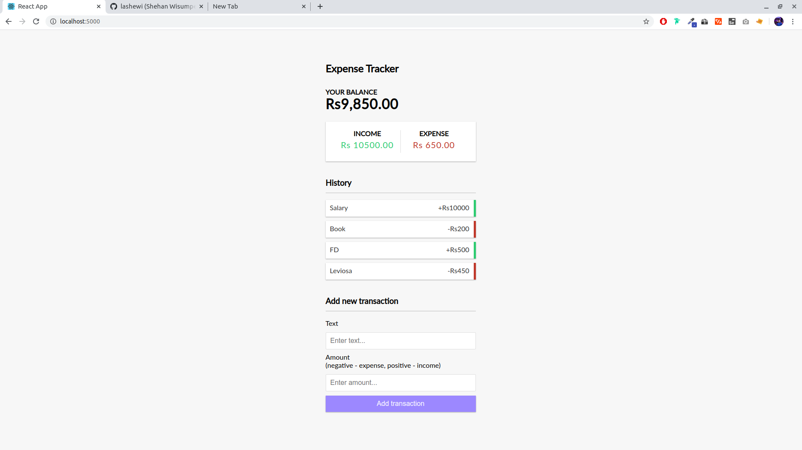

# Expense Tracker

Expense Tracker using ReactJS Frontend and MERN Backend.

## Available Scripts

In the project directory, you can run:

### `npm start`

Runs the app in the **production mode**. 
Open [http://localhost:5000](http://localhost:5000) to view it in the browser.

